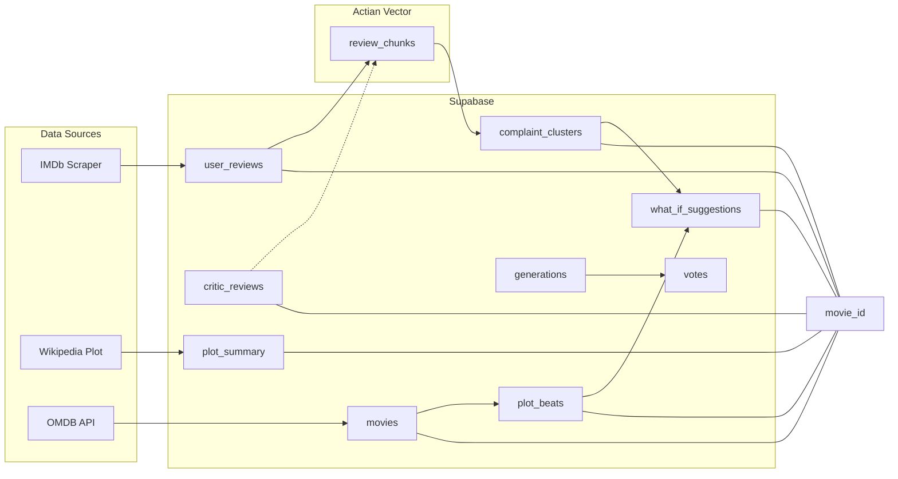

# DirectorsCut — Full Application Build Plan

## Current state

- **Docs only:** [prd.md](prd.md), [actian_vector_db.md](actian_vector_db.md), [imbd_scraper.md](imbd_scraper.md). No app code in repo yet.
- **Existing DB (Supabase)** — inspected via MCP:
  - **user_reviews** (36k+ rows): scraped from **25 chosen movies**; `movie_id`, `movie_title`, `movie_review`, `rating`, etc. Only the IMDb scraper writes here.
  - **critic_reviews** (23k+ rows): pre-existing; lookup by `imdb_id` when present, else by **movie title** (normalized, case-insensitive).
- **MVP scope:** **25 movies** (already in user_reviews) form the base catalog; **search** is required so users can type a movie name and trigger the full pipeline (OMDB → user reviews → critic lookup → embed → Actian). No "3 movies" limit from PRD.
- **POC patterns:** Actian doc = embedding/vector; IMDb doc = scrape → user_reviews. **No Wikipedia plot scraper POC** — see §1.7 for in-depth spec.

---

## Part 1: Backend

### 1.1 Database architecture and keys

Use **IMDb ID** (e.g. `tt0468569`) as the **canonical movie key** everywhere: `user_reviews`, `critic_reviews`, and any new tables.

- **user_reviews:** Populated **only** by the IMDb scraper. Key: `movie_id` (IMDb ID). Use for clustering, embeddings, and "get reviews" by movie.
- **critic_reviews:** **Read-only** in the app; pre-existing data only. When `imdb_id` is null, **search by `title`** (normalized, case-insensitive). Backend supports lookup by `imdb_id` when present, else by `title`.
- **New tables (per PRD §9.1):** Add only what the MVP needs, all keyed by `movie_id` (IMDb ID) where applicable:
  - **movies** — One row per movie; **from OMDB API only** (see §1.4). Store full OMDB response. Primary key: `movie_id` = imdbID. **No re-fetch:** once pulled from OMDB we add to DB and use that. Missing **Poster** → use **placeholder image** in poster component. Rotten Tomatoes / audience from Ratings or imdbRating.
  - **plot_summary** — **Separate table** keyed by `movie_id`: stores Wikipedia Plot section (plain text) for Gemini beats. Create via migration/MCP during build.
  - **plot_beats** — `movie_id` + beat order + label/text (Gemini output from plot).
  - **complaint_clusters** — `movie_id` + cluster_id + label; **dynamic** clustering, **max 7** per movie (frontend displays 5).
  - **cluster_examples** — Links clusters to review chunks (e.g. cluster_id, chunk_id or review reference).
  - **what_if_suggestions** — `movie_id` + suggestion text + linked cluster(s).
  - **generations** — Saved endings (e.g. user/session id, movie_id, story payload, score).
  - **votes** — Votes on generations (generation_id, user/session, value).

**Actian (vector store):** Embed **user_reviews and critic_reviews** (both); key payloads by `movie_id`. **Error handling:** if no critic reviews exist for a movie, continue without failing. Chunk size: 1–3 sentences. Idempotent get-or-create.

### 1.3 Gemini plot and story pipeline (reimagine flow)

- **Plot source for beats:** **Wikipedia plot section primary;** fall back to OMDB Plot if no Wikipedia plot is available.
- **Plot → expanded plot + structured beats:** Feed the Wikipedia-scraped plot (or OMDB fallback) into Gemini. Ask Gemini to (1) produce an **expanded plot** (clearer, more detailed) and (2) **structure it into beats** in an LLM-friendly format. Store both in `movies` / `plot_beats` for story generation.
- **What-if:** Exactly **3 what-if options** per movie, from **top clusters**.
- **Story generation:** **One Gemini call per step** (not one-shot). Each step receives previous choices in context; returns narrative + 3 options (or wrap-up/ending on final step). Narrative **under 8 sentences** per segment. **Tone:** Adapt to the plot and movie theme.
- **Strict JSON** per step: `narrative` and `options[]` (or `ending`); enforce via system prompt + parsing.

### 1.4 Movies table: OMDB API (Context7 docs)

- **Source:** [OMDB API](https://www.omdbapi.com/) — REST API for movie information. Docs referenced via Context7 MCP (`/websites/omdbapi`).
- **Endpoint:** `GET http://www.omdbapi.com/?apikey=[key]&` with **required** `apikey`; use **`i`** (IMDb ID, e.g. tt1285016) or **`t`** (title); optional **`y`** (year), **`plot=full`** for full plot, **`r=json`**.
- **Lookup:** By `i=<imdb_id>` or `t=<title>` (+ optional `y=<year>`). Store full JSON in **movies**. **Multiple results:** when search returns several (e.g. same title, different years), **show results and let user pick** — do not auto-pick first. **No refresh:** once we add from OMDB we use DB only. **Missing Poster:** use **placeholder image** in poster component.
- **Implementation:** Get-or-fetch from DB; if missing, call OMDB (or return search for user to pick), then upsert. Env: `OMDB_API_KEY`. Poster URL or placeholder; RT from `Ratings` or imdbRating.

### 1.5 Search-triggered movie pipeline (no assumptions)

User **search** is the main entry for adding and preparing a movie. When a user types a movie name and selects a result (or we resolve one movie):

1. **OMDB** — Fetch by title/year; if multiple results, **show them and let user pick**. Add/update row in `movies` (no re-fetch later).
2. **IMDb user reviews** — **Use existing always:** check DB first; if we already have user_reviews for this movie_id, **skip scraper** and use existing. **Double-check with DB**; **no duplications**, keep **consistent and in sync**.
3. **Critic reviews** — Search `critic_reviews` by **movie title** (normalized, case-insensitive); attach matches (read-only). **Error handling:** if no critic reviews exist, **continue without failing**.
4. **Embed, chunk, vector** — Chunk **user_reviews and critic_reviews** (both); embeddings → Actian. If no critics, run on user_reviews only. **Cluster right after embedding** (dynamic, **max 7** clusters; frontend shows 5).
5. **Loading UX** — **Single long-running request** with progress. **Timeout: 5 minutes** for full pipeline. Clear, visible loading so the user never assumes the app is stuck.

**MVP catalog:** **25 movies** in `user_reviews`. Search required; use existing data when present.

### 1.6 Identity and community

- **Save ending / vote:** **Anonymous** — identify by session ID or device only; no user accounts.

### 1.7 Wikipedia plot scraper (in-depth — no POC exists)

**Purpose:** Retrieve only the **"Plot"** section from a movie's Wikipedia article. Used as **primary** source for Gemini plot beats; fall back to OMDB Plot if no Wikipedia plot.

**Article discovery (agreed: title + year):**

- Resolve the correct Wikipedia page by **title and year** to avoid disambiguation (e.g. "Superman (2025 film)" or search "Superman" + year filter).
- Inputs: Movie title and year from `movies` (OMDB) or from critic_reviews when no OMDB row yet.

**Section to scrape (agreed: Plot only):**

- Extract **only** the section whose heading is exactly **"Plot"** (case-sensitive match on en.wikipedia). Do not include "Synopsis", "Premise", "Reception", etc.
- If there is no "Plot" section, treat as "no Wikipedia plot" and **fall back to OMDB Plot** for Gemini beats.

**Technical implementation (locked):**

- **Fetch HTML and parse (web scraping).** Get full page HTML, find the heading for the "Plot" section, take content until the next same-level heading. Strip wiki markup to plain text for Gemini.
- **Rate limits / politeness:** Descriptive `User-Agent`; throttle (e.g. 1 req/sec). **en.wikipedia.org** only for MVP.
- **Storage:** **Separate table `plot_summary`** keyed by `movie_id`; store plain-text Plot section. Create via migration/MCP during build. Use for Gemini; if missing, use OMDB Plot. **Plot length:** no max — be generous.

**Edge cases:** No Wikipedia page → fall back to OMDB Plot. Disambiguation → use title+year to pick "(YYYY film)" or first film link. Wiki markup stripped to plain text.

### 1.8 Decisions locked (from clarifying answers)

- **Featured / home:** **All 25 movies**; sorted by **genre** (Netflix-like). Include poster and Rotten Tomatoes score.
- **Share button:** **Not functional** — show **Coming soon**.
- **Explore / leaderboard:** Sort by **votes**.
- **Scoring:** Do not use Sphinx; use **Gemini** for Theme Coverage (simple addressed yes/no per cluster).

### 1.2 Backend phases (high level)

| Phase | Focus | Outcomes |
|-------|-------|----------|
| **B1 — DB and scrapers** | Align Supabase with PRD; **movies from OMDB API**; IMDb scraper → user_reviews; Wikipedia plot scraper. | movies table from OMDB; POST scrape (IMDb), GET reviews; POST/GET plot (Wikipedia). |
| **B2 — Embeddings and Actian** | Chunk user_reviews and critic_reviews, embed, upsert to Actian; idempotent get-or-create. | Ingest script + FastAPI route; vector search by movie_id. |
| **B3 — Clustering and what-if** | Cluster review chunks, label with Gemini, map to plot beats; generate what-if suggestions. | complaint_clusters, cluster_examples, what_if_suggestions; routes by movie_id. |
| **B4 — Plot and beats (Gemini)** | Wikipedia plot → Gemini: expanded plot + structured beats (LLM-friendly). Store in plot_beats. | GET plot and expanded/structured beats by movie_id. |
| **B5 — Story engine (Gemini)** | On what-if selection: feed Gemini plot + structured beats + chosen what-if → strict JSON. | Route returns structured story (intro, step_1–3 with options, wrap-up/ending). Theme Coverage via Gemini. |
| **B6 — Community and misc routes** | Save generation, shareable URL, vote, leaderboard. | POST save ending, GET/POST vote, GET explore/leaderboard sorted by votes. Share button: Coming soon. |

**Testing (backend):** Unit tests for scrapers, embedding pipeline, story/scoring parsing. Integration tests: DB connectivity (Supabase), Actian (or mock).

---

## Part 2: Frontend

### 2.1 Frontend phases (high level)

| Phase | Focus | Outcomes |
|-------|-------|----------|
| **F1 — Shell and design** | App shell, routing, design system (refined elegance palette); **visible loading** for all backend-heavy flows. | Layout, nav, search entry, theme; loading states. |
| **F2 — Discovery and search** | Home: **all 25 movies** sorted by **genre** (Netflix-like); poster + Rotten Tomatoes score; search page. | User can open a movie from home or search and land on analysis. |
| **F3 — Analysis dashboard** | Single movie view: poster hero, complaint clusters, example reviews, plot beats, what-if suggestions. | All data from backend displayed; user can select a what-if. |
| **F4 — Rewrite flow** | Typing animation; set stage → twist → 3 choice rounds → wrap-up → hand-off to ending. | 3-step branching working; progress indicator; API calls for each story step. |
| **F5 — Ending and score** | Ending page: summary, Theme Coverage Score breakdown, evidence panel. | Score and per-cluster evidence from backend displayed. |
| **F6 — Community** | Save ending, share link, vote, explore/leaderboard sorted by votes. Share button: Coming soon. | Save/vote and explore page wired to backend. |

---

## Project tracker (project_tracker.md)

See [project_tracker.md](project_tracker.md) for mini milestones and structure.

---

## Diagram: data and key flow

All movie-scoped data joins on `movie_id` (IMDb ID).

---

## Summary

- **Part 1 (Backend):** DB schema and keys; movies from OMDB; IMDb scraper → user_reviews; critic_reviews read-only; embeddings from user_reviews and critic_reviews; plot → Gemini expanded + structured beats; story from Gemini (one call per step); community routes; integration tests.
- **Part 2 (Frontend):** Shell and design; discovery and search (25 movies, genre sort, Netflix-like); analysis dashboard; rewrite flow (typing, 3 steps); ending and score; community (save/vote/explore, share = Coming soon, leaderboard by votes).
- **Deliverable:** Implement backend first (including DB and tests), then frontend against the API.
